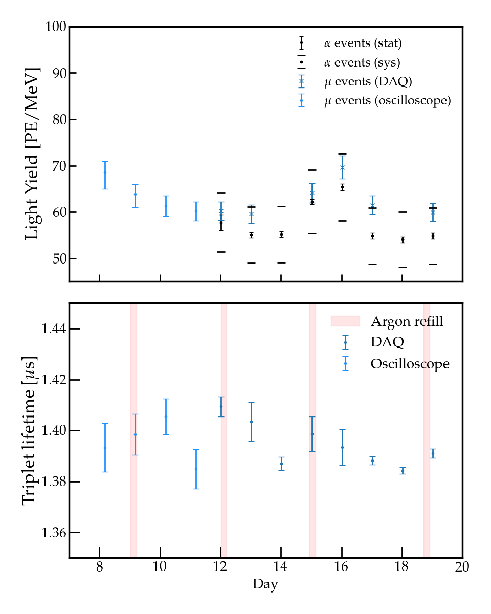
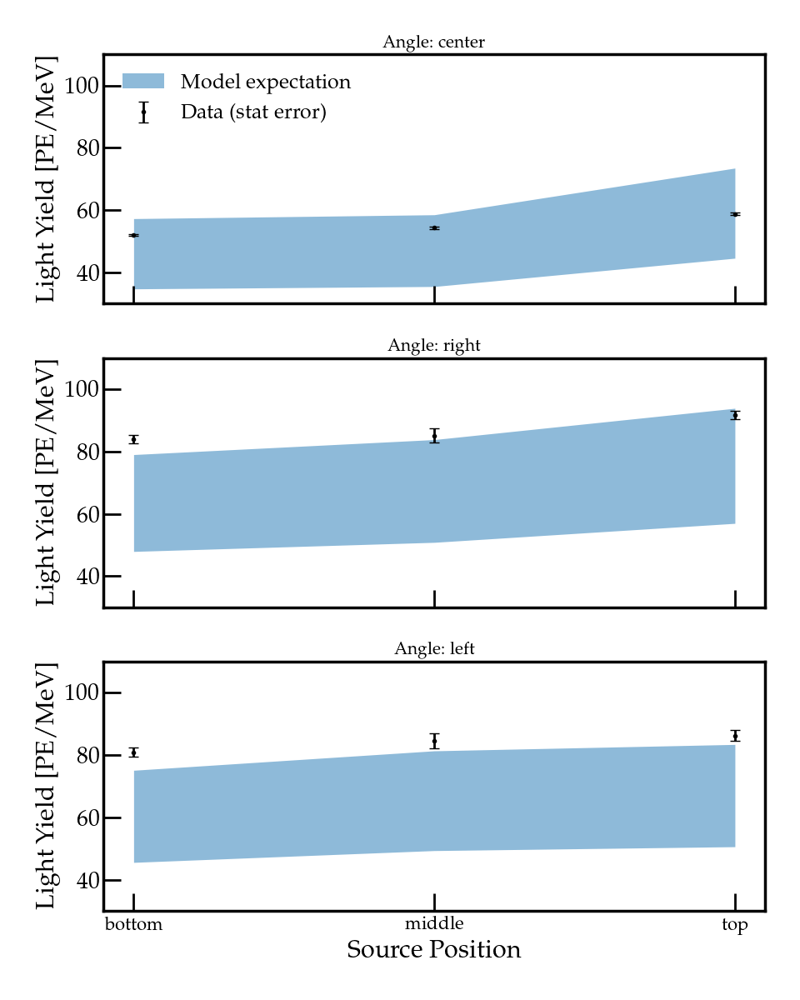

# PEN Wavelength Shifter Characterisation — DWARF Experiment, CERN

Large-scale characterisation of PEN (polyethylene naphthalate) as a wavelength-shifting coating in the DWARF 2-tonne liquid argon detector at CERN. PEN shifts the 128 nm VUV scintillation light of argon to visible wavelengths detectable by standard PMTs — a key enabling technology for next-generation tonne-scale detectors such as DUNE and DarkSide.

An $^{241}$Am alpha source was deployed at multiple positions and angles inside the detector. Light yield was measured daily over 12 days of continuous cryogenic operation, cross-checked against cosmic muon data, and corrected for argon purity drifts using the triplet lifetime as a real-time purity monitor. Spatial scan results are compared to a full GEANT4 photon transport simulation to constrain the PEN wavelength-shifting efficiency.

**Light yield evolution and triplet lifetime over 12 days**

**Key result:** PEN light yield is stable over the full run after purity correction, with alpha and muon measurements in agreement. Spatial scan data is consistent with MC predictions at a PEN WLS efficiency of ~45–58%, supporting PEN adoption as a large-area detector coating in future liquid argon experiments.

**Spatial scan data vs MC expectation for three source angles**

## Analysis
- Day-wise alpha charge spectrum fitting with PSD and pile-up rejection cuts
- Muon pulse shape analysis for argon triplet lifetime extraction (purity monitor)
- Triplet lifetime correction for both alpha and muon light yields
- GEANT4 MC comparison across Z-scan and angular scan source configurations

## Tools
Python · NumPy · Matplotlib · uproot · lmfit · numba · uncertainties
